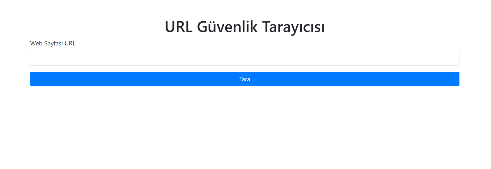
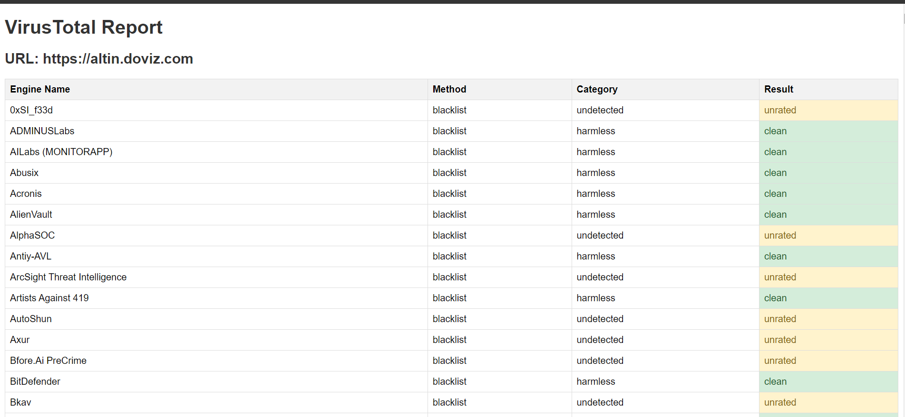

# URL Security Scanner

URL Security Scanner is a Flask-based application that scans URLs extracted from web pages and performs security analysis using the VirusTotal API. This tool is designed to check whether the URLs you specify are safe and present the results in a user-friendly manner.

## Features

- Extracts URLs from web pages.
- Scans extracted URLs using the VirusTotal API.
- Analyzes scan results and presents them to the user.
- User-friendly interface.

## Getting Started

This project can be easily run using Docker. Follow the steps below to get started:

### Prerequisites

- Docker (or Docker Compose, optional)
- Python 3.11 (for local development)
- VirusTotal API key (required for scanning)

### Setup with Docker

1. **Clone the Repository**

   ```bash
   git clone https://github.com/mehmetgencv/url_security_scanner.git
   cd url_security_scanner
   ```

2. **Define Required Environment Variables**

   Create a `.env` file and add the following information:

   ```
   SECRET_KEY=your_secret_key
   API_KEY=your_api_key
   VIRUSTOTAL_BASE_URL=https://www.virustotal.com/api/v3
   ```

   - **SECRET_KEY**: You can generate a random secret key using Python. For example:

     ```bash
     python -c 'import secrets; print(secrets.token_hex(16))'
     ```

   - **API_KEY**: Obtain your VirusTotal API key by signing up at [VirusTotal](https://www.virustotal.com) and navigating to your API key in the dashboard.

3. **Build the Docker Image**

   ```bash
   docker build -t url_security_scanner .
   ```

4. **Run the Docker Container**

   ```bash
   docker run --name dataFlowX -p 5000:5000 --env-file .env url_security_scanner
   ```
5. **Run the Docker Compose**

   ```bash
   docker compose up
   ```

### Local Development

1. **Install Dependencies**

   ```bash
   pip install -r requirements.txt
   ```

2. **Run the Application**

   ```bash
   export FLASK_APP=app.py
   export FLASK_ENV=development
   export SECRET_KEY=your_secret_key
   export VIRUSTOTAL_BASE_URL=https://www.virustotal.com/api/v3
   flask run
   ```

### VirusTotal API v1 Features

The API v1 version provides the following capabilities:

- **Scan URLs**: Submit URLs to VirusTotal for scanning.
- **Retrieve Scan Reports**: Retrieve detailed scan reports for previously scanned URLs.

**Example Request:**

To scan a URL using the VirusTotal API, send a POST request:

```bash
curl --request POST \
  --url https://www.virustotal.com/api/v3/urls \
  --header "x-apikey: your_api_key" \
  --form "url=http://www.example.com"
```

**Example Response:**

```json
{
  "data": {
    "id": "20230821-1122-0000000000000000",
    "type": "analysis"
  }
}
```

### Usage

1. Navigate to `http://localhost:5000/api/v1` in your browser.
2. Enter your API key and the URL you want to scan.
3. Scan the URLs and view the results.
### Application Screenshots

Below are some screenshots of the application in action:

**Dashboard View:**



**Scan Report:**



### License

This project is licensed under the MIT License. See the `LICENSE` file for more details.


